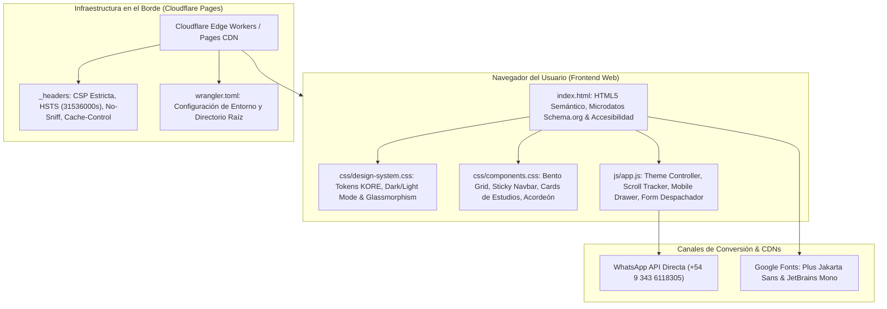
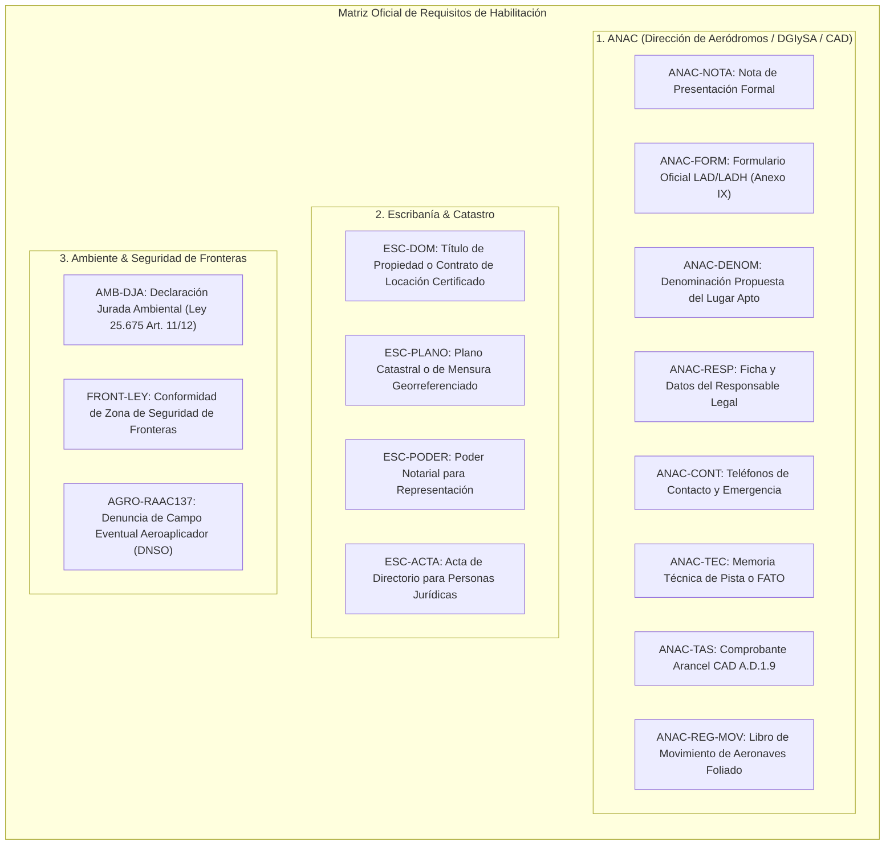
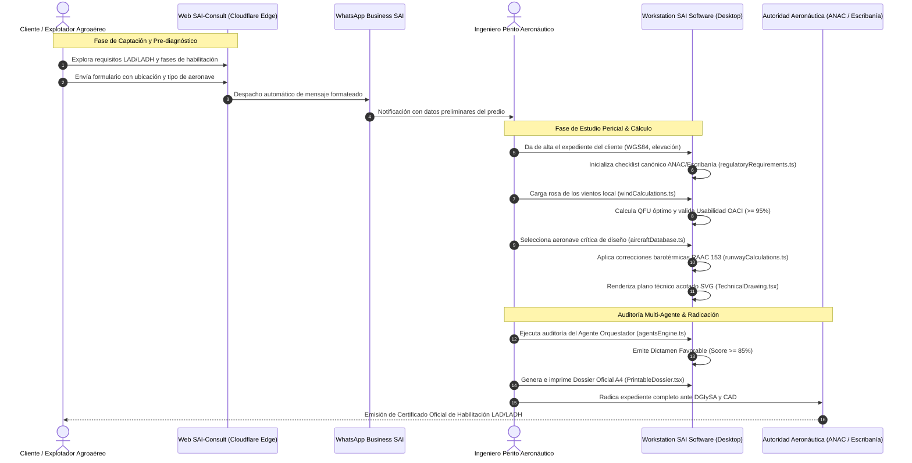

# INFORME TÉCNICO Y ACADÉMICO INTEGRAL DEL SISTEMA SAI CONSULT
## Plataforma Web Corporativa & Software de Ingeniería Aeronáutica de Escritorio
### Estudio de Factibilidad Técnica LAD / LADH, Orientación Magnética QFU, Viento Cruzado y Gestión de Expedientes

---

> **DESTINATARIOS:**  
> - **Ámbito Profesional / Clientes:** Propietarios de campos, empresas de agroaplicación (RAAC 137), sanatorios/hospitales con helipuertos de emergencia, directores de airparks y aviación ejecutiva.  
> - **Ámbito Académico / Docente:** Cátedras universitarias de Ingeniería de Software, Arquitectura de Sistemas Distribuidos, Sistemas Embebidos/Desktop y Legislación Aeronáutica.  
>  
> **AUTOR INSTITUCIONAL:** SAI Consult (Servicios Aeronáuticos Integrales) — Paraná, Entre Ríos, República Argentina.  
> **CANALES DE CONTACTO:** Tel / WhatsApp: `+54 9 343 6118305` | Correo: `saiconsult@gmail.com`  
> **FECHA DE EMISIÓN:** Marzo 2026 | Versión de Documentación: 1.0.0

---

## ÍNDICE GENERAL

1. [RESUMEN EJECUTIVO & MODELO DE NEGOCIO](#1-resumen-ejecutivo--modelo-de-negocio)
   - 1.1. Objeto y Justificación Técnica
   - 1.2. Problemática del Sector Aeronáutico Privado en Argentina
   - 1.3. Propuesta de Valor y Solución Integral Dual (Web + Desktop)
2. [MARCO LEGAL, REGULATORIO Y NORMATIVO APLICABLE](#2-marco-legal-regulatorio-y-normativo-aplicable)
   - 2.1. Código Aeronáutico Argentino (Ley 17.285) y Régimen LAD/LADH
   - 2.2. Regulaciones Argentinas de Aviación Civil (RAAC Parte 153 y Parte 154)
   - 2.3. Estándares Internacionales OACI (Anexo 14 Volúmenes I y II)
   - 2.4. Regulaciones Complementarias: ENACOM, Catastro y Ley General del Ambiente (Ley 25.675)
3. [ARQUITECTURA DE LA PLATAFORMA WEB CORPORATIVA (SAI-CONSULT)](#3-arquitectura-de-la-plataforma-web-corporativa-sai-consult)
   - 3.1. Propósito, Fines y Audiencia Objetivo
   - 3.2. Capas de la Arquitectura Web
   - 3.3. Sistema de Diseño KORE y Ergonomía Visual (Tokens CSS)
   - 3.4. Controlador Front-end y Lógica Reactiva (Vanilla JS)
   - 3.5. Estrategia SEO, Datos Estructurados Schema.org y Rendimiento
   - 3.6. Infraestructura de Despliegue en el Borde (Cloudflare Pages / Wrangler)
4. [ARQUITECTURA DEL SOFTWARE DE ESCRITORIO DE INGENIERÍA (SAI_SOFTWARE)](#4-arquitectura-del-software-de-escritorio-de-ingeniería-sai_software)
   - 4.1. Propósito, Alcance Técnico y Requerimientos de Misión Crítica
   - 4.2. Desglose de Capas del Software (Arquitectura en Capas Limpias)
   - 4.3. Capa de Plataforma Nativa Electron e IPC Seguro
   - 4.4. Capa de Persistencia Híbrida (SQLite Embebido + LocalStorage)
   - 4.5. Capa de Presentación Cockpit Workstation (React 19 & Tailwind CSS v4)
   - 4.6. Capa de Servicios y Orquestación
   - 4.7. Subsistema Multi-Agente Especializado (Diseño, Copywriting, Legal, Orquestador)
5. [MODELADO MATEMÁTICO, FÍSICO Y ALGORITMOS IMPLEMENTADOS](#5-modelado-matemático-físico-y-algoritmos-implementados)
   - 5.1. Declinación Magnética y Rumbo Magnético ($MH$)
   - 5.2. Designación Oficial de Cabeceras de Pista ($QFU$)
   - 5.3. Descomposición Vectorial de Componentes de Viento (Viento Cruzado y Longitudinal)
   - 5.4. Factor de Usabilidad OACI Anexo 14 ($\ge 95\%$)
   - 5.5. Correcciones Reglamentarias de Longitud de Pista (RAAC 153)
   - 5.6. Dimensionamiento Geométrico y Sobrecarga Dinámica de Helipuertos (RAAC 154)
   - 5.7. Algoritmo de Scoring y Ponderación de Viabilidad Multi-Agente
6. [BANCOS DE DATOS Y MATRIZ DOCUMENTAL CANÓNICA](#6-bancos-de-datos-y-matriz-documental-canónica)
   - 6.1. Catálogo Embebido de Aeronaves y Helicópteros de Diseño
   - 6.2. Matriz Documental Canónica Oficial (ANAC, Escribanía, Ambiente, Fronteras, DNSO)
7. [CALIDAD DE CÓDIGO, TESTING AUTOMATIZADO Y CI/CD](#7-calidad-de-código-testing-automatizado-y-cicd)
   - 7.1. Pruebas Unitarias con Vitest (Suites de Cálculo Puro)
   - 7.2. Pipeline de Integración Continua (GitHub Actions)
   - 7.3. Políticas de Linter y Formateo Estricto
8. [COMPARATIVA Y SINFONÍA OPERATIVA ENTRE AMBOS PROYECTOS](#8-comparativa-y-sinfonía-operativa-entre-ambos-proyectos)
9. [CONCLUSIONES Y RECOMENDACIONES TÉCNICAS](#9-conclusiones-y-recomendaciones-técnicas)
10. [REFERENCIAS Y CITAS BIBLIOGRÁFICAS / NORMATIVAS](#10-referencias-y-citas-bibliográficas--normativas)

---

## 1. RESUMEN EJECUTIVO & MODELO DE NEGOCIO

### 1.1. Objeto y Justificación Técnica
El presente informe documenta técnica y académicamente la solución digital integral desarrollada por la consultora aeronáutica **SAI Consult** (Servicios Aeronáuticos Integrales), radicada en Paraná, Provincia de Entre Ríos, República Argentina. 

El ecosistema está compuesto por dos proyectos complementarios:
1. **La Plataforma Web Corporativa (`SAI-Consult`)**: Una aplicación web pública de alta velocidad, desarrollada en Vanilla JavaScript, CSS modular avanzado y HTML5 semántico, diseñada para captación, divulgación técnica, educación normativa, y canalización de prospectos hacia el diagnóstico técnico inicial.
2. **El Software de Ingeniería Aeronáutica de Escritorio (`SAI_Software`)**: Una estación de trabajo profesional de ingeniería (Desktop/Cockpit Workstation) basada en React 19, Electron, SQLite embebido y TypeScript estricto, dotada de una **arquitectura multi-agente** y motores matemáticos de cálculo puro que resuelven la factibilidad geométrica, aeronáutica, barométrica y eólica para pistas de aterrizaje (**LAD**) y helipuertos (**LADH**).

### 1.2. Problemática del Sector Aeronáutico Privado en Argentina
En la República Argentina, el uso de pistas no controladas en estancias agropecuarias, empresas forestales, sanatorios privados y aeroclubes ha operado históricamente bajo esquemas informales o con tramitaciones fragmentadas. Sin embargo, el **Código Aeronáutico de la Nación (Ley 17.285)** en sus artículos 25 a 35 establece que todo aeródromo o lugar apto denunciado debe contar con habilitación formal ante la **Administración Nacional de Aviación Civil (ANAC)**.

Operar una pista no habilitada acarrea:
- **Responsabilidad Civil y Penal:** Invalidez de las pólizas de seguros aeronáuticos en caso de siniestro (despistes, colisiones, daños a terceros en la superficie).
- **Vulneración de Servidumbres Aeronáuticas:** Riesgo de invasión física de las Superficies Limitadoras de Obstáculos (SLO) por tendidos eléctricos de media/alta tensión, mástiles de telecomunicaciones no coordinados ante **ENACOM** o forestación descontrolada.
- **Sanciones Administrativas y Clausura:** Intervención de la Dirección General de Infraestructura y Servicios Aeroportuarios (DGIySA) de la ANAC y de los municipios locales por incompatibilidad en el uso del suelo.
- **Inseguridad Operativa:** Pistas mal orientadas respecto a los vientos dominantes que superan las componentes de viento cruzado demostradas de las aeronaves agrícolas o ejecutivas, provocando accidentes en despegue o aterrizaje.

### 1.3. Propuesta de Valor y Solución Integral Dual (Web + Desktop)
SAI Consult transforma este proceso crítico mediante la conjunción de:
- **Canal Web de Alta Conversión (`SAI-Consult`):** Explica al cliente en lenguaje comprensible las 6 fases de habilitación, desmitifica los costos y tiempos, e integra un canal directo de pre-diagnóstico vía WhatsApp Business.
- **Workstation de Ingeniería de Precisión (`SAI_Software`):** Permite al ingeniero perito cargar los datos del cliente, modelar la aeronave de diseño, calcular vectorialmente la rosa de vientos con 16 rumbos, aplicar las correcciones por elevación, temperatura y pendiente según la **RAAC 153/154**, y coordinar un dictamen de auditoría multi-agente con emisión automática de un **Dossier Técnico Imprimible** listo para mesa de entradas de ANAC y Escribanía.

---

## 2. MARCO LEGAL, REGULATORIO Y NORMATIVO APLICABLE

El sistema informatiza y audita con precisión matemática el siguiente corpus jurídico-aeronáutico:

### 2.1. Código Aeronáutico Argentino (Ley 17.285) y Régimen LAD/LADH
- **Artículo 25 a 28:** Definición de aeródromos públicos y privados. Los lugares de aterrizaje privados son aquellos destinados exclusivamente al uso de personas autorizadas por su titular.
- **Artículo 29:** Reconocimiento de los **Lugares Aptos Denunciados (LAD)**. Faculta el aterrizaje y despegue en sitios no habilitados formalmente como aeródromos públicos, siempre que hayan sido denunciados ante la autoridad aeronáutica nacional y cumplan con los estándares de seguridad operacional requeridos.
- **Artículos 30 a 35 (Limitaciones al Dominio y Servidumbres Aeronáuticas):** En las áreas contiguas a los aeródromos y pistas se establecen zonas de despeje de obstáculos. Ninguna persona física o jurídica puede erigir construcciones, tendidos ni plantar especies arbóreas que vulneren las pendientes de aproximación y transición.

### 2.2. Regulaciones Argentinas de Aviación Civil (RAAC Parte 153 y Parte 154)
- **RAAC Parte 153 ("Normas para el Diseño de Aeródromos"):**
  - Clasificación de pistas mediante la **Clave de Referencia de Aeródromo** (números 1 a 4 según longitud básica de campo; letras A a F según envergadura y anchura exterior de ruedas del tren principal).
  - Factores de corrección de longitud por altitud barométrica, temperatura máxima del mes más cálido y pendiente longitudinal.
  - Dimensiones reglamentarias de la pista, franja de seguridad nivelada (*Runway Strip*) y Área de Seguridad de Extremo de Pista (*RESA*).
- **RAAC Parte 154 ("Diseño y Operación de Helipuertos"):**
  - Clasificación de helipuertos en superficie (*Surface*), elevados (*Elevated*) y de emergencias médicas / hospitalarios (*Hospital*).
  - Parámetro fundamental de diseño **$D$**: dimensión máxima total del helicóptero con los rotores en funcionamiento.
  - Dimensiones del Área de Toma de Contacto y Elevación (**TLOF**) y Área de Aproximación Final y Despegue (**FATO**).
  - Requisitos de sobrecarga dinámica estructural de impacto: coeficiente del $150\%$ del MTOW ($1.5 \times \text{MTOW}$).
- **RAAC Parte 137 ("Trabajo Aéreo y Aeroaplicación"):**
  - Subparte E (Sección 137.41): Régimen de excepción para explotadores agroaéreos mediante denuncia de "Campos Eventuales", alternativa contemplada en la matriz documental del software.

### 2.3. Estándares Internacionales OACI (Anexo 14 Volúmenes I y II)
- **OACI Anexo 14 Volumen I (Aeródromos):**
  - **Capítulo 3, Sección 3.1.1 (Coeficiente de Usabilidad):** El número y orientación de las pistas deben elegirse de forma tal que el coeficiente de utilización del aeródromo **no sea inferior al 95%** para las aeronaves que el aeródromo esté destinado a atender.
  - Límites de viento cruzado admisible:
    - **$20\text{ kt}$ ($37\text{ km/h}$):** Para aeronaves con longitud de campo de referencia $\ge 1500\text{ m}$ (Claves 3 y 4).
    - **$13\text{ kt}$ ($24\text{ km/h}$):** Para aeronaves con longitud de referencia entre $1200\text{ m}$ y $1499\text{ m}$ (Clave 2).
    - **$10\text{ kt}$ ($19\text{ km/h}$):** Para aeronaves con longitud de referencia $< 1200\text{ m}$ (Clave 1: aviación ligera, fumigadores tipo Pawnee / Air Tractor, Cessna 172).
- **OACI Anexo 14 Volumen II (Helipuertos):**
  - Trayectorias de aproximación y despegue: Provisión obligatoria de al menos 2 trayectorias separadas preferentemente por al menos $150^\circ$. Pendientes límite de aproximación visual ($8.0\%$ estándar; $4.5\%$ para aproximaciones despejadas).

### 2.4. Regulaciones Complementarias
- **Ente Nacional de Comunicaciones (ENACOM):**
  - Certificación de No Afectación Radioeléctrica en un radio de 5 km alrededor del punto de referencia del aeródromo (ARP).
  - Régimen de homologación y asignación de frecuencia VHF aeronáutica en la banda reglamentaria de $118.000\text{ MHz}$ a $136.975\text{ MHz}$.
- **Catastro Notarial:**
  - Título de dominio o contrato de arrendamiento registrado ante escribano público nacional.
  - Plano de mensura georreferenciado en coordenadas geodésicas oficiales **WGS84** (o POSGAR 07).
- **Medio Ambiente (Ley General del Ambiente 25.675):**
  - Presentación de Declaración Jurada Ambiental (Artículos 11 y 12) ante el organismo provincial o comunal competente.
- **Zona de Seguridad de Frontera (Ley 23.554 y Dto-Ley 15.385/44):**
  - En predios limítrofes, intervención previa de la Superintendencia de Fronteras dependiente del Ministerio de Defensa.

---

## 3. ARQUITECTURA DE LA PLATAFORMA WEB CORPORATIVA (SAI-CONSULT)

> **Ubicación en el repositorio:** `C:\Users\Luciano\.gemini\antigravity-ide\scratch\SAI-Consult`  
> **Documento de Mapeo Técnico:** [`Docs/ARCHITECTURE_MAP.md`](file:///C:/Users/Luciano/.gemini/antigravity-ide/scratch/SAI-Consult/Docs/ARCHITECTURE_MAP.md)

### 3.1. Propósito, Fines y Audiencia Objetivo
La plataforma web corporativa cumple un triple propósito:
1. **Adquisición y Conversión de Clientes:** Convertir el tráfico orgánico de búsqueda de productores agropecuarios, clínicas médicas y pilotos privados en consultas técnicas calificadas.
2. **Pedagogía Técnico-Legal:** Explicar la necesidad regulatoria de habilitar pistas ante la ANAC y los riesgos del Art. 29 de la Ley 17.285.
3. **Pre-calificación Automatizada:** A través de un formulario con validación nativa que serializa los datos de la pista proyectada y los remite instantáneamente al canal de WhatsApp del equipo de ingeniería.

### 3.2. Capas de la Arquitectura Web
La aplicación web se estructuró bajo el principio de **Zero-Dependency Vanilla Architecture** para maximizar la velocidad de carga (LCP < 1.0s), garantizar el 100% de accesibilidad WCAG y posibilitar un despliegue sin costos de servidor en el borde (Edge Network).

### 3.3. Sistema de Diseño KORE y Ergonomía Visual (Tokens CSS)
Inspirado en la estética técnica **KORE (AI Consulting Firm)**, adaptada a la aviación de alta precisión:
- **Canvas de Obsidiana (`--bg-primary: #07090E`)**: Fondo de cabina nocturna que reduce la fatiga visual.
- **Acentos Cyan Aviónica (`--cyan-primary: #00E5FF`) y Ámbar de Balizamiento (`--amber-primary: #FFB300`)**: Remiten al instrumental PFD (*Primary Flight Display*) y a las luces de aproximación VASI/PAPI.
- **Modo Claro Arquitectónico (`[data-theme="light"]`)**: Invierte la paleta hacia un fondo blanco técnico papel milimetrado (`#F8FAFC`) con contrastes calculados según WCAG AA.
- **Glassmorphism**: Tarjetas con `backdrop-filter: blur(12px)` y bordes translúcidos de `1px solid rgba(255, 255, 255, 0.08)`.
- **Fuente de Cita:** [`css/design-system.css:L1-L180`](file:///C:/Users/Luciano/.gemini/antigravity-ide/scratch/SAI-Consult/css/design-system.css) y [`css/components.css:L1-L320`](file:///C:/Users/Luciano/.gemini/antigravity-ide/scratch/SAI-Consult/css/components.css).

### 3.4. Controlador Front-end y Lógica Reactiva (Vanilla JS)
El archivo [`js/app.js`](file:///C:/Users/Luciano/.gemini/antigravity-ide/scratch/SAI-Consult/js/app.js) implementa:
1. **Gestor de Tema (`ThemeManager`):** Evalúa `localStorage.getItem('sai-theme')` o la preferencia del sistema operativo `window.matchMedia('(prefers-color-scheme: light)')`. Alterne reactivo sin recarga de página.
2. **Sticky Navbar Effect:** Listener optimizado sobre `window.scrollY > 40px` que inyecta la clase `.scrolled`, modificando la píldora flotante con sombra difusa y resplandor cyan.
3. **Mobile Nav Drawer & Scroll Lock:** Menú lateral animado para pantallas móviles que bloquea el scroll del `body` mediante la clase `.nav-open` y responde a la tecla `Escape` o toques fuera del contenedor.
4. **Acordeón Exclusivo FAQ:** Mide la altura dinámica mediante `content.scrollHeight + 'px'` para lograr transiciones CSS de apertura/cierre de fluidez perfecta.
5. **Serializador y Despachador de Contacto:** Captura los campos del formulario (`contactName`, `contactPhone`, `contactFacility`, `contactLocation`, `contactMessage`), sanitiza las entradas y compone una URI codificada para el endpoint `https://wa.me/5493436118305?text=...`.

### 3.5. Estrategia SEO, Datos Estructurados Schema.org y Rendimiento
- **Marcado JSON-LD Doble:** 
  - `ProfessionalService` & `LocalBusiness`: Con coordenadas de Paraná, Entre Ríos, horario de atención, teléfono y catálogo de servicios de ingeniería.
  - `FAQPage`: Estructura las 6 preguntas más frecuentes para generar *Rich Snippets* destacados en Google.
- **Archivos Canónicos:** [`sitemap.xml`](file:///C:/Users/Luciano/.gemini/antigravity-ide/scratch/SAI-Consult/sitemap.xml) y [`robots.txt`](file:///C:/Users/Luciano/.gemini/antigravity-ide/scratch/SAI-Consult/robots.txt).
- **Seguridad Estricta en Cabeceras HTTP:** Archivo [`_headers`](file:///C:/Users/Luciano/.gemini/antigravity-ide/scratch/SAI-Consult/_headers) con `X-Frame-Options: SAMEORIGIN`, `X-Content-Type-Options: nosniff`, `Strict-Transport-Security: max-age=31536000` y políticas de caché en el borde.

### 3.6. Infraestructura de Despliegue en el Borde (Cloudflare Pages)
- El archivo [`wrangler.toml`](file:///C:/Users/Luciano/.gemini/antigravity-ide/scratch/SAI-Consult/wrangler.toml) configura el proyecto para su publicación en Cloudflare Pages.
- El manifiesto [`package.json`](file:///C:/Users/Luciano/.gemini/antigravity-ide/scratch/SAI-Consult/package.json) define el script `"deploy": "wrangler pages deploy ."`, permitiendo una integración continua instantánea ligada a la rama principal de Git.

---

## 4. ARQUITECTURA DEL SOFTWARE DE ESCRITORIO DE INGENIERÍA (SAI_SOFTWARE)

> **Ubicación en el repositorio:** `c:\Users\Luciano\Desktop\Proyectos\SAI_Software`  
> **Documento de Mapeo Técnico:** [`Docs/SYSTEM_MAP.md`](file:///c:/Users/Luciano/Desktop/Proyectos/SAI_Software/Docs/SYSTEM_MAP.md)

### 4.1. Propósito, Alcance Técnico y Requerimientos de Misión Crítica
`SAI_Software` es una aplicación de escritorio diseñada para uso exclusivo de los ingenieros aeronáuticos de SAI Consult. Sus requerimientos no funcionales abarcan:
- **Disponibilidad Offline Absoluta (Zero-Cloud Dependency):** Los relevamientos de campo en zonas rurales carecen frecuentemente de conectividad 4G/5G. El sistema debe operar al 100% de forma autónoma.
- **Integridad y Persistencia ACID:** Almacenamiento transaccional de expedientes en una base de datos local embebida SQLite.
- **Aislamiento de la Computación Matemática:** Las funciones físicas de vientos y correcciones de pista deben ser puras y no depender del ciclo de vida de React, garantizando reproducibilidad pericial.
- **Emisión de Documentos Oficiales:** Generación de un dossier técnico imprimible en formato A4 con membrete formal, tablas vectorizadas y firmas de peritaje.

### 4.2. Desglose de Capas del Software (Arquitectura en Capas Limpias)

```mermaid
graph TD
    subgraph Desktop_Host ["Plataforma Host Electron (Proceso Principal)"]
        E_MAIN["electron/main.cjs: Ciclo de vida BrowserWindow e IPC Handlers"]
        E_PRELOAD["electron/preload.cjs: ContextBridge window.electronAPI"]
        E_DB["electron/database.cjs: node:sqlite DatabaseSync (sai_consult.db)"]
    end

    subgraph UI_Cockpit ["Capa de Presentación UI (React 19 & Tailwind v4)"]
        APP_ROOT["App.tsx: Orquestador de Vistas, Modales y Notificaciones"]
        NAVBAR["Navbar.tsx: Reloj Dual UTC/Local, Estado de Agentes & Backups"]
        CLI_MOD["ClientList.tsx & ClientFolder.tsx: Expedientes y Clientes"]
        DOC_MOD["DocumentChecklist.tsx: Matriz Oficial ANAC/Escribanía"]
        WIND_MOD["WindStudyView.tsx & WindRoseChart.tsx: Rosa SVG 16 Rumbos"]
        LAD_MOD["LadStudyView.tsx & LadhStudyView.tsx: Factibilidad RAAC"]
        DRAW_MOD["TechnicalDrawing.tsx: Esquemas Técnicos Acotados SVG"]
        DOSSIER["PrintableDossier.tsx: Vista de Impresión A4 de Dictamen"]
    end

    subgraph Multi_Agents ["Subsistema Multi-Agente Especializado"]
        AG_DSG["🎨 Agente Diseño: Geometría, Márgenes de Seguridad & Cotas"]
        AG_CPY["📐 Agente Copywriting: Georreferenciación WGS84 & Glosario"]
        AG_LEG["⚖️ Agente Legal: Auditoría RAAC 153/154, Ley 17.285 & ENACOM"]
        AG_ORC["🧠 Agente Orquestador: Evaluación Cruzada, Scoring & Dictamen"]
    end

    subgraph Services_Orchestration ["Capa de Servicios y Orquestación"]
        SVC_STORE["storageService.ts: Persistencia Dual SQLite / LocalStorage"]
        SVC_WIND["windEngine.ts: Orquestador de Estudios de Viento"]
        SVC_LAD["ladEngine.ts: Orquestador de Pistas de Aterrizaje"]
        SVC_LADH["ladhEngine.ts: Orquestador de Helipuertos"]
        SVC_AGENTS["agentsEngine.ts: Motor de Reglas Multi-Agente"]
    end

    subgraph Pure_Calculations ["Motores Matemáticos Puros (Sin Efectos Secundarios)"]
        CALC_WIND["windCalculations.ts: Declinación, QFU, Viento Cruzado, Usabilidad OACI"]
        CALC_RWY["runwayCalculations.ts: ISA, Elevación, Temp, Pendiente, RESA"]
        CALC_HELI["helipadCalculations.ts: FATO, TLOF, Safety Area, Carga 1.5x MTOW"]
        CALC_AUDIT["auditCalculations.ts: Estadísticas de Avance y Scoring"]
    end

    Desktop_Host --> UI_Cockpit
    UI_Cockpit --> Services_Orchestration
    UI_Cockpit --> Multi_Agents
    Services_Orchestration --> Pure_Calculations
    Multi_Agents --> Pure_Calculations
    Services_Orchestration --> Desktop_Host
```

### 4.3. Capa de Plataforma Nativa Electron e IPC Seguro
- **Proceso Principal (`electron/main.cjs`):** Configura la ventana principal con `nodeIntegration: false` y `contextIsolation: true`. Registra los canales IPC (`ipcMain.handle`): `db:getClients`, `db:saveClient`, `db:deleteClient`, `db:updateDocStatus`, `db:saveWindStudy`, `db:saveLadStudy`, `db:saveLadhStudy`.
- **Script Preload (`electron/preload.cjs`):** Utiliza `contextBridge.exposeInMainWorld('electronAPI', ...)` para exponer métodos asíncronos fuertemente tipados hacia el entorno React.
- **Motor de Base de Datos Nativo (`electron/database.cjs`):** Utiliza la nueva biblioteca estándar `node:sqlite` (`DatabaseSync`), inicializando el esquema relacional en el archivo `sai_consult.db` dentro del directorio `userData` del sistema operativo.
- **Fuente de Cita:** [`electron/main.cjs:L1-L69`](file:///c:/Users/Luciano/Desktop/Proyectos/SAI_Software/electron/main.cjs) y [`electron/database.cjs:L1-L257`](file:///c:/Users/Luciano/Desktop/Proyectos/SAI_Software/electron/database.cjs).

### 4.4. Capa de Persistencia Híbrida (SQLite Embebido + LocalStorage)
El archivo [`src/services/storageService.ts`](file:///c:/Users/Luciano/Desktop/Proyectos/SAI_Software/src/services/storageService.ts) proporciona resiliencia de datos mediante un patrón de persistencia híbrida:
1. **Detección Automática del Entorno:** Si `window.electronAPI` está presente (ejecución como app de escritorio), sincroniza cada operación de guardado contra SQLite embebido.
2. **Fallback Reactivo en Navegador:** Si se ejecuta en modo desarrollo web (`npm run dev` en Vite), almacena y lee los datos desde `localStorage` bajo las claves `sai_consult_clients`, `sai_consult_wind_studies`, `sai_consult_lad_studies` y `sai_consult_ladh_studies`.
3. **Migración Automática de Esquemas:** Al iniciar, verifica si los clientes almacenados poseen la lista canónica de documentos regulatorios de ANAC/Escribanía. Si detecta registros heredados, migra automáticamente la estructura sin pérdida de datos.
4. **Respaldo Integral JSON:** Permite exportar la totalidad de la base de datos en un único archivo `.json` con marca de tiempo para migración entre estaciones de trabajo.

### 4.5. Capa de Presentación Cockpit Workstation (React 19 & Tailwind CSS v4)
- **Ergonomía de Cabina Aeronáutica:** Interfaz técnica con tipografías monoespaciadas para parámetros numéricos y diseño estructurado en tarjetas de aviónica.
- **Visualizador SVG Vectorial de Vientos (`WindRoseChart.tsx`):** Renderiza en tiempo real los 16 sectores de la rosa de los vientos, superponiendo el eje físico de la pista orientado según su QFU magnético, los polígonos de frecuencia meteorológica y el cono de tolerancia de viento cruzado.
- **Esquema Técnico Acotado SVG (`TechnicalDrawing.tsx`):** Dibuja a escala paramétrica la pista, el ancho de pavimento, la franja de seguridad (*Strip*) y las áreas de seguridad de extremo (*RESA*), con cotas acotadas en metros y alertas visuales si las dimensiones exceden el terreno disponible del predio.
- **Expediente Imprimible (`PrintableDossier.tsx`):** Optimizado con directivas `@media print` para generar informes periciales en formato A4 con membrete oficial, firmas del responsable técnico, dictamen del orquestador y desgloses de auditoría.

### 4.6. Capa de Servicios y Orquestación
- **`windEngine.ts`:** Coordina la matriz meteorológica histórica, ejecuta la descomposición vectorial y persiste el estudio en el expediente del cliente.
- **`ladEngine.ts`:** Carga la aeronave de diseño, extrae sus longitudes básicas de campo de despegue y aterrizaje, aplica las correcciones barotérmicas y evalúa los márgenes espaciales del predio.
- **`ladhEngine.ts`:** Calcula la geometría FATO/TLOF en función del parámetro $D$ y la capacidad portante del helipuerto frente a la carga dinámica del helicóptero de diseño.

### 4.7. Subsistema Multi-Agente Especializado
El sistema incorpora un equipo de 4 agentes de software especializados definidos en [`src/types/agents.ts`](file:///c:/Users/Luciano/Desktop/Proyectos/SAI_Software/src/types/agents.ts) y evaluados por [`src/services/agentsEngine.ts`](file:///c:/Users/Luciano/Desktop/Proyectos/SAI_Software/src/services/agentsEngine.ts):

| Agente Especializado | Icono & Rol | Responsabilidad Operativa & Reglas Auditadas |
| :--- | :--- | :--- |
| **Agente de Diseño & Ergonomía** | 🎨 `Palette` | Verifica dimensiones mínimas de pista y helipuerto, márgenes de franja de pista ($\ge 60\text{m}$ o $80\text{m}$), zonas RESA, holgura perimetral frente a los límites catastrales del predio y supervisión de esquemas SVG. |
| **Agente de Arquitectura & Copywriting** | 📐 `FileText` | Audita la estandarización de la nomenclatura oficial OACI/ANAC, verifica la presencia de coordenadas geodésicas en formato WGS84 para el Punto de Referencia de Aeródromo (ARP) y redacta los resúmenes ejecutivos. |
| **Agente Legal & Regulatorio** | ⚖️ `Scale` | Audita el avance de la matriz documental ante ANAC (Anexo IX, arancel CAD A.D.1.9, registro de movimientos), Escribanía (título de propiedad o contrato de locación certificado, mensura), ENACOM y Declaración Jurada Ambiental (Ley 25.675). |
| **Agente Orquestador Master** | 🧠 `Cpu` | Validador cruzado integral. Pondera las conclusiones de los otros 3 agentes, ejecuta el algoritmo de scoring de viabilidad (0-100%), define el semáforo de viabilidad y habilita la emisión del Dictamen Pericial SAI. |

---

## 5. MODELADO MATEMÁTICO, FÍSICO Y ALGORITMOS IMPLEMENTADOS

> **Archivos Fuente de los Motores Puros:**  
> - [`src/calculations/windCalculations.ts`](file:///c:/Users/Luciano/Desktop/Proyectos/SAI_Software/src/calculations/windCalculations.ts)  
> - [`src/calculations/runwayCalculations.ts`](file:///c:/Users/Luciano/Desktop/Proyectos/SAI_Software/src/calculations/runwayCalculations.ts)  
> - [`src/calculations/helipadCalculations.ts`](file:///c:/Users/Luciano/Desktop/Proyectos/SAI_Software/src/calculations/helipadCalculations.ts)  
> - [`src/calculations/auditCalculations.ts`](file:///c:/Users/Luciano/Desktop/Proyectos/SAI_Software/src/calculations/auditCalculations.ts)

A continuación se detallan exhaustivamente los fundamentos matemáticos y físicos de cada algoritmo implementado en el sistema:

### 5.1. Declinación Magnética y Rumbo Magnético ($MH$)
El eje de la pista se define geométricamente en los planos de mensura mediante su **Rumbo Geográfico Verdadero** ($TH$, *True Heading*), referido al Polo Norte Geográfico. Sin embargo, las aeronaves navegan y operan orientadas por brújulas y giróscopos magnéticos referidos al Polo Norte Magnético.

La **Declinación Magnética local** ($Decl$) es el ángulo entre el Norte Verdadero y el Norte Magnético en el punto de emplazamiento:
- Se considera positiva ($+$) si el polo magnético se encuentra al Este del meridiano geográfico.
- Se considera negativa ($-$) si se encuentra al Oeste (situación habitual en la mayor parte del territorio argentino, típicamente $-7^\circ$ a $-11^\circ$ W).

La fórmula matemática para obtener el Rumbo Magnético ($MH$, *Magnetic Heading*) es:
$$MH = (TH - Decl) \pmod{360^\circ}$$
Con normalización angular estricta al rango $[0^\circ, 360^\circ)$:
$$\text{Si } MH < 0^\circ \implies MH = MH + 360^\circ$$
$$\text{Si } MH \ge 360^\circ \implies MH = MH - 360^\circ$$

El rumbo recíproco o cabecera opuesta ($MH_{recip}$) se ubica exactamente a $180^\circ$:
$$MH_{recip} = (MH + 180^\circ) \pmod{360^\circ}$$

*Cita en Código:* [`src/calculations/windCalculations.ts:L44-L85`](file:///c:/Users/Luciano/Desktop/Proyectos/SAI_Software/src/calculations/windCalculations.ts#L44-L85).

### 5.2. Designación Oficial de Cabeceras de Pista ($QFU$)
Según la normativa OACI Anexo 14 y RAAC 153, las cabeceras de pista se identifican mediante un designador numérico de dos dígitos correspondiente a la decena entera más próxima de su rumbo magnético:

$$QFU_1 = \left\lfloor \frac{MH}{10} \right\rceil$$
$$\text{Si } QFU_1 \in \{0, 36\} \implies QFU_1 = 36$$

Para la cabecera recíproca:
$$QFU_2 = \left\lfloor \frac{MH_{recip}}{10} \right\rceil$$
$$\text{Si } QFU_2 \in \{0, 36\} \implies QFU_2 = 36$$

Donde la notación $\lfloor x \rceil$ denota el operador matemático formal de redondeo al entero más próximo ($\lfloor x + 0.5 \rfloor$). Ambos números se formatean con dos dígitos utilizando cero a la izquierda (`padStart(2, '0')`). La designación oficial de la pista se expresa colocando en primer lugar el número menor (ejemplo: si $MH = 042^\circ \implies QFU_1 = 04$, $MH_{recip} = 222^\circ \implies QFU_2 = 22$; designador oficial: **"04 / 22"**).

*Cita en Código:* [`src/calculations/windCalculations.ts:L63-L84`](file:///c:/Users/Luciano/Desktop/Proyectos/SAI_Software/src/calculations/windCalculations.ts#L63-L84).

---

### 5.3. Descomposición Vectorial de Componentes de Viento
Dado un viento observado con procedencia $\theta_{v}$ (en grados cardinales) y módulo de velocidad $V$ (en nudos, $\text{kt}$), respecto al eje físico de pista con rumbo magnético $\theta_p$:

El ángulo relativo de incidencia $\Delta\theta$ se define como:
$$\Delta\theta = |\theta_v - \theta_p| \cdot \left(\frac{\pi}{180}\right) \quad [\text{radianes}]$$

1. **Componente Transversal o Viento Cruzado ($V_{cross}$):**
   Es la componente perpendicular al eje de la pista que tiende a desplazar lateralmente a la aeronave durante la carrera de despegue o aproximación final:
   $$V_{cross} = V \cdot |\sin(\Delta\theta)| \quad [\text{kt}]$$

2. **Componente Longitudinal ($V_{long}$):**
   Es la proyección colineal al eje de la pista:
   $$V_{long} = V \cdot \cos(\Delta\theta) \quad [\text{kt}]$$
   - Si $V_{long} > 0$: Se define como **Viento de Frente (*Headwind*)**, el cual es favorable pues incrementa la velocidad relativa del aire sobre las alas, acortando la carrera de despegue y aterrizaje.
   - Si $V_{long} < 0$: Se define como **Viento de Cola (*Tailwind*)**, situación crítica que degrada la sustentación y aumenta peligrosamente la distancia requerida de frenado (admisible reglamentariamente solo hasta 5 kt).

*Cita en Código:* [`src/calculations/windCalculations.ts:L99-L114`](file:///c:/Users/Luciano/Desktop/Proyectos/SAI_Software/src/calculations/windCalculations.ts#L99-L114).

---

### 5.4. Factor de Usabilidad OACI Anexo 14 ($\ge 95\%$)
El estándar internacional OACI Anexo 14 (Volumen I, Sección 3.1.1) exige que la orientación de la pista garantice que las operaciones de aterrizaje y despegue puedan llevarse a cabo **al menos el 95% del tiempo** sin exceder el viento cruzado admisible para la aeronave de diseño.

Dado que las pistas pueden utilizarse en ambos sentidos (cabecera $QFU_1$ o cabecera recíproca $QFU_2$), para cada sector angular de viento de procedencia $\theta_j$ ($j = 1, \dots, 16$ rumbos cardinales: N, NNE, NE, ..., NNW):

El ángulo mínimo respecto a ambas orientaciones operativas es:
$$\phi_1 = \min(|\theta_j - MH|, 360^\circ - |\theta_j - MH|)$$
$$\phi_2 = \min(|\theta_j - MH_{recip}|, 360^\circ - |\theta_j - MH_{recip}|)$$
$$\phi_{min} = \min(\phi_1, \phi_2)$$

Para un rango o intervalo de velocidad de viento con cota superior $V_k$ (rangos de 0-5 kt, 6-10 kt, 11-15 kt, 16-20 kt, 21+ kt):
$$V_{cross, j, k} = V_k \cdot \sin\left(\phi_{min} \cdot \frac{\pi}{180}\right)$$

La condición de operabilidad para ese estrato meteorológico es:
$$V_{cross, j, k} \le V_{max\_admisible}$$
Donde $V_{max\_admisible} \in \{10\text{ kt}, 13\text{ kt}, 20\text{ kt}\}$ según la clave del aeródromo.

El **Factor de Usabilidad Total ($U$)** se calcula integrando las frecuencias climatológicas porcentuales $f_{j,k}$ de cada celda favorable, sumando el porcentaje de períodos de calma meteorológica ($f_{calmas}$, donde el viento es nulo y por definición $100\%$ operable):
$$U = f_{calmas} + \sum_{j=1}^{16} \sum_{k} f_{j,k} \cdot \mathbb{I}(V_{cross, j, k} \le V_{max\_admisible})$$

**Criterio de Dictamen OACI:**
$$\text{Conforme OACI} \iff U \ge 95.0\%$$

*Cita en Código:* [`src/calculations/windCalculations.ts:L144-L187`](file:///c:/Users/Luciano/Desktop/Proyectos/SAI_Software/src/calculations/windCalculations.ts#L144-L187).

---

### 5.5. Correcciones Reglamentarias de Longitud de Pista (RAAC 153)
La longitud básica de campo de referencia declarada por el fabricante de la aeronave ($L_0$) está calculada para condiciones estándar de laboratorio: a nivel del mar ($h = 0\text{ m}$) y temperatura estándar de la Atmósfera Tipo Internacional (**ISA**, $15^\circ\text{C}$ a nivel del mar y $1013.25\text{ hPa}$).

En un emplazamiento real, la menor densidad del aire debida a la altitud y a las altas temperaturas reduce el empuje de los motores y la sustentación de las alas, exigiendo mayor velocidad respecto al suelo y consecuentemente una pista más larga. 

La RAAC Parte 153 (en concordancia con OACI Doc 9157 Parte 1) establece la siguiente secuencia de correcciones acumulativas:

#### 1. Corrección por Elevación sobre el Nivel del Mar ($C_e$)
La longitud básica debe aumentarse a razón de un **$7\%$ por cada 300 metros** de elevación sobre el nivel medio del mar (MSL):
$$L_1 = L_0 \cdot \left[1 + 0.07 \cdot \left(\frac{h_{MSL}}{300}\right)\right]$$
Donde $h_{MSL}$ es la elevación del aeródromo en metros.  
El incremento en metros es: $\Delta L_{elev} = L_1 - L_0$.

#### 2. Corrección por Temperatura de Referencia ($C_t$)
La temperatura estándar ISA a la elevación del emplazamiento decrece con un gradiente vertical estándar de $-6.5^\circ\text{C}$ por cada $1000\text{ m}$ ($-0.0065^\circ\text{C/m}$):
$$T_{ISA} = 15 - 0.0065 \cdot \max(0, h_{MSL}) \quad [^\circ\text{C}]$$

Sea $T_{ref}$ la temperatura de referencia del aeródromo (definida como la media mensual de las temperaturas máximas diarias del mes más caluroso del año). Si $T_{ref} > T_{ISA}$, la longitud ya corregida por elevación ($L_1$) debe aumentarse a razón de un **$1\%$ por cada grado Celsius** de exceso térmico:
$$\Delta T = \max(0, T_{ref} - T_{ISA})$$
$$L_2 = L_1 \cdot (1 + 0.01 \cdot \Delta T)$$
El incremento por temperatura es: $\Delta L_{temp} = L_2 - L_1$.

#### 3. Corrección por Pendiente Longitudinal Efectiva ($C_s$)
Si la pista presenta una pendiente longitudinal ascendente en el sentido de despegue (definida como el desnivel entre cabeceras dividido la longitud de pista, expresado en porcentaje $S$), la aceleración se ve frenada por la componente de gravedad. La longitud $L_2$ debe incrementarse un **$10\%$ por cada $1\%$ de pendiente efectiva**:
$$L_{final} = \lceil L_2 \cdot (1 + 0.10 \cdot S) \rceil$$
El incremento por pendiente es: $\Delta L_{pendiente} = L_{final} - L_2$.

#### Dimensionamiento de Franja de Pista (*Strip*) y RESA (RAAC 153)
- **Ancho de Pista ($W_{rwy}$):**
  - $18\text{ m}$: Clave de aeródromo 1 (envergadura $< 15\text{ m}$).
  - $23\text{ m}$: Clave 2 o envergadura entre $15\text{ m}$ y $24\text{ m}$.
  - $30\text{ m}$: Clave 3 (aeronaves mayores tipo King Air / Metro).
- **Franja de Seguridad (*Runway Strip*):**
  - Longitud total requerida: $\text{Strip}_{long} = L_{final} + 120\text{ m}$ (extensión obligatoria de $60\text{ m}$ más allá de cada cabecera).
  - Ancho total de franja: $60\text{ m}$ (pistas de Clave 1) u $80\text{ m}$ (pistas de Clave 2 o superior).
- **Área de Seguridad de Extremo de Pista (*RESA*):**
  - Longitud mínima: $60\text{ m}$.
  - Ancho mínimo: $\max(30\text{ m}, 2 \times W_{rwy})$.

*Cita en Código:* [`src/calculations/runwayCalculations.ts:L6-L189`](file:///c:/Users/Luciano/Desktop/Proyectos/SAI_Software/src/calculations/runwayCalculations.ts#L6-L189).

---

### 5.6. Dimensionamiento Geométrico y Sobrecarga Dinámica de Helipuertos (RAAC 154)
Para helipuertos LADH, el diseño está determinado por las características del helicóptero más exigente previsto para operar (aeronave crítica de diseño), definido por:
- **$D$:** Dimensión máxima del helicóptero con los rotores girando (desde el extremo del rotor principal hasta el rotor de cola), en metros.
- **$RD$:** Diámetro del rotor principal, en metros.
- **$\text{MTOW}$:** Peso máximo de despegue (*Maximum Take-Off Weight*), en kilogramos.

#### 1. Área de Toma de Contacto y Elevación (TLOF)
Superficie reforzada con capacidad para absorber las cargas estáticas y dinámicas de aterrizaje:
$$\text{TLOF}_{min} = \begin{cases} 
0.83 \cdot D & \text{Helipuerto en superficie, helicóptero mono-motor / Clase 2 o 3} \\ 
1.00 \cdot D & \text{Helipuerto elevado, hospitalario o helicóptero bimotor / Clase 1 de performance} 
\end{cases}$$

#### 2. Área de Aproximación Final y Despegue (FATO)
Área despejada que contiene a la TLOF y en la cual concluye la maniobra de aproximación o despegue:
$$\text{FATO}_{min} = \begin{cases} 
1.50 \cdot D & \text{Helipuerto a nivel del terreno (en superficie)} \\ 
1.20 \cdot D & \text{Helipuerto elevado o heliplataforma} 
\end{cases}$$

#### 3. Área de Seguridad Perimetral (*Safety Area*)
Franja perimetral libre de obstáculos que rodea a la FATO para mitigar el riesgo de desviaciones no controladas:
$$\text{Margen}_{seguridad} = \max(0.25 \cdot D, 3.0\text{ m})$$

Dimensión mínima cuadrangular o diametral total del predio despejado:
$$\text{Dimensión Total} = \text{FATO}_{min} + 2 \cdot \text{Margen}_{seguridad}$$

#### 4. Resistencia Estructural de Carga Dinámica de Impacto ($P_{diseño}$)
En maniobras de aterrizaje brusco o autorrotación, las fuerzas dinámicas transmitidas al pavimento o heliplataforma sobrepasan el peso estático. La RAAC 154 fija un factor de impacto del **$150\%$**:
$$P_{diseño} = 1.50 \cdot \text{MTOW} \quad [\text{kg}]$$

*Cita en Código:* [`src/calculations/helipadCalculations.ts:L8-L144`](file:///c:/Users/Luciano/Desktop/Proyectos/SAI_Software/src/calculations/helipadCalculations.ts#L8-L144).

---

### 5.7. Algoritmo de Scoring y Ponderación de Viabilidad Multi-Agente
El Agente Orquestador Master integra los resultados técnicos, meteorológicos y jurídicos en una función de evaluación que produce un puntaje normalizado de **0 a 100%** y clasifica el proyecto en una escala de tres niveles (*Semáforo de Viabilidad*).

La función objetivo se define como:
$$\text{Score} = \text{Score}_{documental} + \text{Score}_{viento} + \text{Score}_{tecnico} - \text{Penalizaciones}$$

Donde:
1. **Aporte Documental (Máximo 40 puntos):**
   $$\text{Score}_{documental} = \left(\frac{\text{Documentos Aprobados}}{\text{Total Documentos}}\right) \times 40$$
   *Penalización por observaciones:* $-5\text{ puntos}$ por cada documento que presente observaciones ante la autoridad de aplicación.

2. **Aporte de Orientación y Viento Cruzado OACI (Máximo 20 puntos):**
   $$\text{Score}_{viento} = \begin{cases} 
   20 & \text{si Usabilidad } U \ge 95.0\% \\ 
   8 & \text{si Usabilidad } U < 95.0\% \\ 
   15 & \text{si el estudio de vientos aún no ha sido cargado (neutral)} 
   \end{cases}$$

3. **Aporte de Factibilidad Técnica y Geométrica LAD / LADH (Máximo 40 puntos):**
   $$\text{Score}_{tecnico} = \begin{cases} 
   40 & \text{si la viabilidad geométrica es FACTIBLE} \\ 
   25 & \text{si es FACTIBLE CONDICIONADO (requiere nivelación o margen ajustado)} \\ 
   5 & \text{si es NO FACTIBLE (dimensiones o capacidad portante insuficientes)} 
   \end{cases}$$

El puntaje resultante se acota al intervalo $[0, 100]$.

#### Criterio de Decisión del Dictamen Pericial:
- **FAVORABLE:** $\text{Score} \ge 85\%$ **Y** $0$ documentos observados **Y** $100\%$ de los documentos obligatorios aprobados **Y** viabilidad técnica plena.
- **FAVORABLE CONDICIONADO:** $\text{Score} \in [60\%, 84\%]$ **O** viabilidad geométrica condicionada por topografía **O** usabilidad de vientos $< 95\%$ pero con posibilidades de pista cruzada **O** trámites obligatorios en curso.
- **NO FAVORABLE (NO FACTIBLE):** $\text{Score} < 60\%$ **O** cualquier documento con observaciones rechazadas **O** predio físico insuficiente para contener la pista con sus fajas de seguridad **O** capacidad portante estructural menor a $1.5 \times \text{MTOW}$.

*Cita en Código:* [`src/calculations/auditCalculations.ts:L65-L121`](file:///c:/Users/Luciano/Desktop/Proyectos/SAI_Software/src/calculations/auditCalculations.ts#L65-L121) y [`src/services/agentsEngine.ts:L285-L370`](file:///c:/Users/Luciano/Desktop/Proyectos/SAI_Software/src/services/agentsEngine.ts#L285-L370).

---

## 6. BANCOS DE DATOS Y MATRIZ DOCUMENTAL CANÓNICA

### 6.1. Catálogo Embebido de Aeronaves y Helicópteros de Diseño
Para evitar la carga manual repetitiva y garantizar la precisión de los cálculos, el software integra dos bases de datos técnicas verificadas:

#### Aeronaves de Pista ([`src/data/aircraftDatabase.ts`](file:///c:/Users/Luciano/Desktop/Proyectos/SAI_Software/src/data/aircraftDatabase.ts)):
| Aeronave | Fabricante | Longitud Básica $L_0$ | Envergadura | MTOW | Viento Cruzado Demostrado | Clave OACI | Aplicación Típica |
| :--- | :--- | :---: | :---: | :---: | :---: | :---: | :--- |
| **Cessna Skyhawk 172S** | Cessna | $510\text{ m}$ | $11.0\text{ m}$ | $1157\text{ kg}$ | $15\text{ kt}$ | 1A | Aviación general, traslados privados, instrucción |
| **Cessna Skylane 182T** | Cessna | $580\text{ m}$ | $11.0\text{ m}$ | $1406\text{ kg}$ | $15\text{ kt}$ | 1A | Vuelos inter-estancias, transporte rural |
| **Piper Pawnee PA-25-235** | Piper | $420\text{ m}$ | $11.0\text{ m}$ | $1315\text{ kg}$ | $12\text{ kt}$ | 1A | Aeroaplicación agrícola (RAAC 137), fumigación |
| **Air Tractor AT-402B** | Air Tractor | $670\text{ m}$ | $15.5\text{ m}$ | $3175\text{ kg}$ | $17\text{ kt}$ | 1B | Aeroaplicación intensiva, lucha contra incendios |
| **Beechcraft King Air B200** | Beechcraft | $780\text{ m}$ | $16.6\text{ m}$ | $5670\text{ kg}$ | $25\text{ kt}$ | 2B | Vuelo corporativo ejecutivo, taxi aéreo |

#### Helicópteros ([`src/data/helicopterDatabase.ts`](file:///c:/Users/Luciano/Desktop/Proyectos/SAI_Software/src/data/helicopterDatabase.ts)):
| Helicóptero | Fabricante | Parámetro $D$ | Diámetro Rotor $RD$ | MTOW | Carga Dinámica $1.5\times$ | Uso Principal |
| :--- | :--- | :---: | :---: | :---: | :---: | :--- |
| **Robinson R44 Raven II** | Robinson | $11.7\text{ m}$ | $10.1\text{ m}$ | $1134\text{ kg}$ | $1701\text{ kg}$ | Vigilancia rural, traslados privados |
| **Airbus Helicopters EC130 T2** | Airbus | $12.6\text{ m}$ | $10.7\text{ m}$ | $2500\text{ kg}$ | $3750\text{ kg}$ | Aviación corporativa, turismo ejecutivo |
| **Bell 429 GlobalRanger** | Bell | $13.1\text{ m}$ | $11.0\text{ m}$ | $3402\text{ kg}$ | $5103\text{ kg}$ | Evacuación médica sanitaria (HEMS), offshore |
| **Sikorsky S-76D** | Sikorsky | $16.0\text{ m}$ | $13.4\text{ m}$ | $5307\text{ kg}$ | $7961\text{ kg}$ | Helipuerto hospitalario mayor, ejecutivo pesado |

---

### 6.2. Matriz Documental Canónica Oficial
Definida en [`src/data/regulatoryRequirements.ts`](file:///c:/Users/Luciano/Desktop/Proyectos/SAI_Software/src/data/regulatoryRequirements.ts), centraliza la totalidad de los trámites ante organismos nacionales y provinciales para la habilitación de un LAD o LADH en Argentina:

---

## 7. CALIDAD DE CÓDIGO, TESTING AUTOMATIZADO Y CI/CD

### 7.1. Pruebas Unitarias con Vitest (Suites de Cálculo Puro)
Para garantizar la solidez científica exigida en un dictamen pericial, el repositorio `SAI_Software` implementa una suite de pruebas unitarias automatizadas con **Vitest**, ubicada en el directorio `tests/calculations/`:

1. **`windCalculations.test.ts` (6 tests):**
   - Normalización angular en el intervalo $[0^\circ, 360^\circ)$.
   - Cálculo de rumbo magnético aplicando declinación positiva y negativa.
   - Designador QFU de pista principal y recíproca con redondeo reglamentario.
   - Descomposición vectorial ortogonal de viento cruzado, viento de frente y viento de cola.
   - Integración histórica de usabilidad OACI ($\ge 95\%$) con viento cruzado de 10, 13 y 20 kt.
2. **`runwayCalculations.test.ts` (7 tests):**
   - Gradiente térmico estándar de la atmósfera ISA según elevación.
   - Corrección por elevación ($+7\%$ cada $300\text{ m}$).
   - Corrección acumulativa por exceso de temperatura sobre ISA ($+1\%$ cada $1^\circ\text{C}$).
   - Corrección por pendiente longitudinal ($+10\%$ cada $1\%$).
   - Dimensionamiento de franja nivelada de pista y zonas de parada RESA.
   - Detección de terrenos con longitud o anchura física insuficiente.
3. **`helipadCalculations.test.ts` (5 tests):**
   - Dimensionamiento de TLOF para helipuertos en superficie vs elevados/hospitalarios.
   - Cálculo de FATO ($1.5D$) y margen del Área de Seguridad ($\ge 0.25D$ o $3\text{ m}$).
   - Verificación de la sobrecarga dinámica estructural de impacto ($1.5 \times \text{MTOW}$).
   - Evaluación de viabilidad geométrica y trayectorias de aproximación separadas por $150^\circ$.
4. **`auditCalculations.test.ts` (5 tests):**
   - Cálculo de estadísticas de avance de la matriz documental.
   - Ponderación de viabilidad y penalización por documentos observados.
   - Asignación rigurosa de dictámenes: Favorable, Condicionado o No Favorable.

**Total de Pruebas Unitarias Automatizadas:** **23 tests**, con 100% de tasa de éxito.

### 7.2. Pipeline de Integración Continua (GitHub Actions)
Definido en [`.github/workflows/ci.yml`](file:///c:/Users/Luciano/Desktop/Proyectos/SAI_Software/.github/workflows/ci.yml), el pipeline ejecuta en cada *push* o *pull request* hacia la rama principal:
1. **Linting:** Ejecución de ESLint (`eslint .`) bajo configuración plana (*flat config*).
2. **Testing:** Ejecución desatendida de la suite completa de Vitest (`npm test`).
3. **Type-Checking & Build:** Validación estricta del compilador de TypeScript (`tsc`) y compilación del bundle de producción con Vite (`vite build`).

---

## 8. COMPARATIVA Y SINFONÍA OPERATIVA ENTRE AMBOS PROYECTOS

Para un docente evaluador o un cliente corporativo, resulta fundamental apreciar cómo ambos repositorios se articulan en un flujo de trabajo sincronizado de punta a punta:

---

## 9. CONCLUSIONES Y RECOMENDACIONES TÉCNICAS

### 9.1. Conclusiones para el Cliente
1. **Seguridad Jurídica y Patrimonial:** La tramitación formal del registro LAD/LADH elimina la contingencia de clausuras y garantiza la plena validez de las coberturas de seguros frente a cualquier contingencia operacional.
2. **Optimización de Costos de Movimiento de Suelos:** El cálculo paramétrico de longitud corregida y la verificación de usabilidad de vientos evitan sobrecostos por desmontes o pavimentaciones innecesarias, asegurando que la pista tenga exactamente los metros requeridos por la normativa.
3. **Acompañamiento Técnico Llave en Mano:** Desde el relevamiento aerotopográfico inicial hasta la entrega del libro foliado de movimientos habilitado por la Dirección Regional de ANAC.

### 9.2. Conclusiones para la Evaluación Académica / Docente
1. **Ingeniería de Software de Misión Crítica:** El proyecto demuestra una separación estricta de responsabilidades (Clean Architecture), donde las fórmulas físicas y normativas se implementan como funciones puras desacopladas del framework de interfaz, permitiendo pruebas unitarias determinísticas y reproducibles.
2. **Subsistema Multi-Agente:** El modelado de agentes de software especializados (Diseño, Copywriting, Legal, Orquestador) introduce un patrón moderno de auditoría cruzada que emula el funcionamiento de un comité pericial de ingeniería multidisciplinario.
3. **Persistencia Híbrida y Portabilidad:** La articulación entre la nueva API `node:sqlite` de Node.js en Electron y el almacenamiento local en navegadores dota al software de una robustez transaccional offline insustituible para el trabajo pericial de campo en áreas rurales.

---

## 10. REFERENCIAS Y CITAS BIBLIOGRÁFICAS / NORMATIVAS

1. **República Argentina (1967):** *Ley N° 17.285 - Código Aeronáutico de la Nación*. Honorable Congreso de la Nación. Artículos 25 a 35 (Aeródromos y Servidumbres Aeronáuticas).
2. **Administración Nacional de Aviación Civil - ANAC (2019):** *Regulaciones Argentinas de Aviación Civil (RAAC) - Parte 153: Normas para el Diseño de Aeródromos*. Buenos Aires, Argentina.
3. **Administración Nacional de Aviación Civil - ANAC (2018):** *Regulaciones Argentinas de Aviación Civil (RAAC) - Parte 154: Diseño y Operación de Helipuertos*. Buenos Aires, Argentina.
4. **Organización de Aviación Civil Internacional - OACI (2018):** *Anexo 14 al Convenio sobre Aviación Civil Internacional - Aeródromos. Volumen I: Diseño y operaciones de aeródromos* (8ª edición). Montreal, Canadá.
5. **Organización de Aviación Civil Internacional - OACI (2020):** *Anexo 14 al Convenio sobre Aviación Civil Internacional - Aeródromos. Volumen II: Helipuertos* (5ª edición). Montreal, Canadá.
6. **Organización de Aviación Civil Internacional - OACI (2006):** *Manual de diseño de aeródromos - Parte 1: Pistas (Doc 9157-AN/901)*. Montreal, Canadá.
7. **República Argentina (2002):** *Ley N° 25.675 - Ley General del Ambiente*. Presupuestos mínimos para el logro de una gestión sustentable y adecuada del ambiente. Artículos 11 y 12.
8. **Ente Nacional de Comunicaciones - ENACOM:** *Normativa sobre Estaciones Radioeléctricas Aeronáuticas y Despeje de Mástiles de Telecomunicaciones*.
9. **Código Fuente y Citas de Mapeo Interno:**
   - Mapa de Arquitectura del Software: [`c:\Users\Luciano\Desktop\Proyectos\SAI_Software\Docs\SYSTEM_MAP.md`](file:///c:/Users/Luciano/Desktop/Proyectos/SAI_Software/Docs/SYSTEM_MAP.md)
   - Compendio Normativo del Software: [`c:\Users\Luciano\Desktop\Proyectos\SAI_Software\Docs\NORMATIVA_ANAC_ENACOM.md`](file:///c:/Users/Luciano/Desktop/Proyectos/SAI_Software/Docs/NORMATIVA_ANAC_ENACOM.md)
   - Formulación Matemática del Software: [`c:\Users\Luciano\Desktop\Proyectos\SAI_Software\Docs\CALCULOS_AERONAUTICOS.md`](file:///c:/Users/Luciano/Desktop/Proyectos/SAI_Software/Docs/CALCULOS_AERONAUTICOS.md)
   - Mapa de Arquitectura de la Plataforma Web: [`C:\Users\Luciano\.gemini\antigravity-ide\scratch\SAI-Consult\Docs\ARCHITECTURE_MAP.md`](file:///C:/Users/Luciano/.gemini/antigravity-ide/scratch/SAI-Consult/Docs/ARCHITECTURE_MAP.md)

---
*Informe generado y rubricado por el Sistema Pericial de Auditoría Multi-Agente de SAI Consult.*  
*Paraná, Entre Ríos, República Argentina.*
